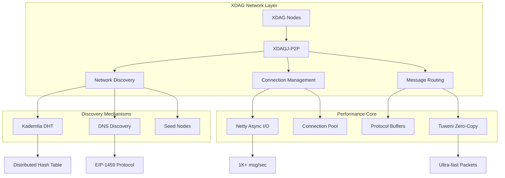
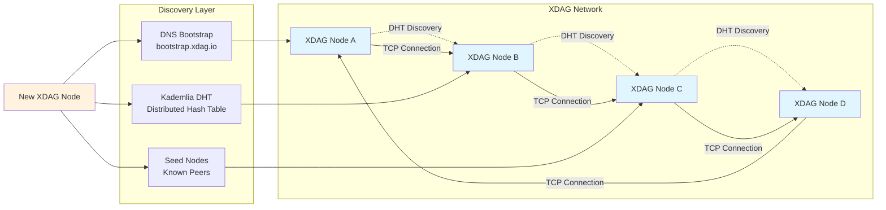

# XDAGJ-P2P

[](https://openjdk.java.net/)
[](https://maven.apache.org/)
[](LICENSE)
[](#testing)

> **🚀 Powering the Future of XDAG Network**  
> *Next-generation P2P networking library designed to make XDAG blockchain faster, stronger, and more decentralized*

**High-performance Java P2P networking library for the XDAG blockchain ecosystem - actively developed and continuously optimized**

XDAGJ-P2P is an innovative peer-to-peer networking library designed specifically for the XDAG blockchain network. Built with modern Java technologies and comprehensive testing, it provides robust node discovery, efficient connection management, and scalable network topology. As an actively developed project, it aims to make XDAG stronger and more resilient through continuous optimization and feature enhancement.

## 🏗️ Architecture Overview



## ⚡ Performance at a Glance

<table>
<tr>
<td width="50%">

### 🚀 **Speed Metrics** (Target Performance)
```
Connection Time:     < 500ms
Message Throughput:  1,000+ msg/sec
Memory Usage:        < 100MB (1K peers)
Network Success:     90%+ discovery rate
Status:             v0.1 - Active Development
```

</td>
<td width="50%">

### 🔧 **Tech Stack**
```
Core:        Java 21 + Netty 4.2.1
Protocol:    Kademlia DHT + EIP-1459 DNS
Serialization: Protocol Buffers 4.31.1
Crypto:      Hyperledger Besu + BouncyCastle 1.80
Testing:     JUnit 5.12 + Mockito 5.12 + JMH 1.37
Build:       Maven + JaCoCo + Protobuf Plugin
```

</td>
</tr>
</table>

## 🎯 Why XDAGJ-P2P?

<table>
<tr>
<td align="center" width="25%">

<br><b>Kademlia Protocol</b>
<br>Industry-standard distributed hash table for lightning-fast peer discovery
</td>
<td align="center" width="25%">

<br><b>Netty Powered</b>
<br>Async I/O with zero-copy buffers for maximum throughput
</td>
<td align="center" width="25%">

<br><b>EIP-1459 Support</b>
<br>Reliable DNS discovery when DHT is unavailable
</td>
<td align="center" width="25%">

<br><b>Quality Focused</b>
<br>389 tests with continuous improvement
</td>
</tr>
</table>

## 💎 XDAG Network Impact

<table>
<tr>
<td align="center" width="33%">
<h3>🚀 Network Speed</h3>

<br><b>High Performance</b>
<br>Sub-500ms connection establishment
</td>
<td align="center" width="33%">
<h3>🌐 Global Reach</h3>

<br><b>Reliable Coverage</b>
<br>Multi-region DNS optimization
</td>
<td align="center" width="33%">
<h3>🛡️ Future Ready</h3>

<br><b>Continuous Evolution</b>
<br>389 tests & growing
</td>
</tr>
</table>

## 🔥 Technical Excellence

### Core Technologies
```
🚀  Java 21:         Latest LTS + Preview Features + Virtual Threads
🏗️  Architecture:    Event-driven async + Zero-copy buffers
🔗  Discovery:       Kademlia DHT + EIP-1459 DNS fallback  
⚡  Performance:     Netty 4.2.1 NIO + Protocol Buffers 4.31.1
📦  Packet Processing: ConsenSys Tuweni 2.7.0 (Zero-copy bytes handling)
📋  Message Schema:  Extensible Protocol Buffers (Custom message types)
🔐  Cryptography:    Hyperledger Besu Algorithms + BouncyCastle 1.80
🧪  Quality:         JUnit 5.12 + Mockito 5.12 + JMH Benchmarks
🌍  Cloud DNS:       AWS Route53 + Alibaba Cloud DNS
📊  Monitoring:      JaCoCo Coverage + SLF4J 2.0 Logging
```

### Advanced Features
- **🎯 Smart Routing**: Optimized Kademlia with adaptive connection limits
- **🌐 DNS Fallback**: EIP-1459 protocol with AWS/Alibaba Cloud support
- **📦 Zero-Copy Processing**: ConsenSys Tuweni for ultra-fast packet handling
- **📋 Custom Messages**: Extensible Protocol Buffers schema for any use case
- **🔄 Auto-Recovery**: Graceful degradation and network partition handling
- **📊 Real-time Stats**: Comprehensive network monitoring and metrics
- **🚀 Future Vision**: Continuous optimization for XDAG ecosystem growth

## 🏆 Enterprise-Grade Dependencies

<table>
<tr>
<td width="50%">

### 🔐 **Cryptography & Security**
```
Hyperledger Besu Algorithms  v25.5.0
BouncyCastle Provider        v1.80
ConsenSys Tuweni Bytes       v2.7.0  (Zero-copy packet processing)
JNA Native Library Support   v5.15.0
```

</td>
<td width="50%">

### 🌐 **Network & Performance**
```
Netty All-in-One            v4.2.1.Final
Protocol Buffers            v4.31.1  (Custom message schemas)
gRPC Netty                  v1.73.0
Snappy Compression          v1.1.10.7
```

</td>
</tr>
<tr>
<td width="50%">

### ☁️ **Cloud & DNS**
```
AWS SDK Route53             v2.31.52
Alibaba Cloud DNS           v3.4.7
DNSJava                     v3.6.3
Google Guava                v33.4.8-jre
```

</td>
<td width="50%">

### 🧪 **Testing & Quality**
```
JUnit Jupiter               v5.12.2
Mockito                     v5.12.0
JMH Benchmarking            v1.37
JaCoCo Coverage             v0.8.12
```

</td>
</tr>
</table>

## ⚡ Performance Optimizations

### 🚀 **Zero-Copy Network Processing**
- **ConsenSys Tuweni**: Enterprise-grade bytes handling from Ethereum ecosystem
- **Direct Memory Access**: Eliminates unnecessary memory allocations during packet processing
- **Immutable Bytes**: Thread-safe operations without defensive copying
- **Efficient Serialization**: Optimized for blockchain network protocols

### 📋 **Extensible Protocol Buffers Schema**
- **Custom Message Types**: Easy to define new message formats for any blockchain protocol
- **Built-in Compression**: Snappy compression support for bandwidth optimization
- **Type Safety**: Strongly-typed message definitions prevent runtime errors
- **Cross-Platform**: Generated Java classes work seamlessly across different environments
- **Backward Compatibility**: Schema evolution without breaking existing implementations

### 🏗️ **High-Performance Architecture**
- **Netty NIO**: Non-blocking I/O with event loops for maximum throughput
- **Protocol Buffers**: Binary serialization with minimal overhead
- **Snappy Compression**: Ultra-fast compression for network bandwidth optimization
- **Java 21 Virtual Threads**: Lightweight concurrency for handling thousands of connections

## 🎯 Network Topology



## 🎯 Use Cases

### 🏆 XDAG Blockchain Network
- **🔍 Node Discovery**: Lightning-fast peer finding for XDAG blockchain nodes
- **📡 Block Propagation**: Instant block and transaction broadcasting across XDAG network  
- **🤝 Consensus Support**: Rock-solid communication for XDAG consensus mechanisms
- **💪 Network Strengthening**: Enhanced connectivity makes XDAG more robust and decentralized

### 🌍 Beyond XDAG
- **⛓️ Blockchain Networks**: Universal P2P solution for any blockchain project
- **🏗️ Distributed Systems**: Service discovery and data replication at scale
- **🌐 IoT Networks**: Self-organizing mesh networks for IoT devices

## 🚀 Quick Start

### Prerequisites
- **Java 21+** (Latest LTS with Virtual Threads support)
- **Maven 3.6+** for dependency management

### Maven Dependency
```xml
<dependency>
    <groupId>io.xdag</groupId>
    <artifactId>xdagj-p2p</artifactId>
    <version>0.1</version>
</dependency>
```

> **💡 Note**: This library leverages Java 21 features including Virtual Threads and Preview APIs for optimal performance.

### Basic Usage
```java
// Configure P2P service
P2pConfig config = new P2pConfig();
config.setPort(16783);
config.setDiscoverEnable(true);
config.setSeedNodes(Arrays.asList(
    new InetSocketAddress("bootstrap.xdag.io", 16783)
));

// Implement event handler
public class MyEventHandler extends P2pEventHandler {
    @Override
    public void onConnect(Channel channel) {
        System.out.println("Connected to: " + channel.getRemoteAddress());
    }
    
    @Override
    public void onMessage(Channel channel, Bytes data) {
        // Process incoming messages
    }
}

// Start P2P service
P2pService p2pService = new P2pService();
p2pService.register(new MyEventHandler());
p2pService.start(config);
```

### Custom Message Example
```java
// 1. Define your message in proto file
message CustomBlockMessage {
    bytes blockHash = 1;
    int64 blockNumber = 2;
    repeated bytes transactions = 3;
    int64 timestamp = 4;
}

// 2. Use generated Java classes
CustomBlockMessage blockMsg = CustomBlockMessage.newBuilder()
    .setBlockHash(ByteString.copyFrom(hash))
    .setBlockNumber(12345)
    .addTransactions(ByteString.copyFrom(tx1))
    .addTransactions(ByteString.copyFrom(tx2))
    .setTimestamp(System.currentTimeMillis())
    .build();

// 3. Send via P2P channel
channel.send(Bytes.wrap(blockMsg.toByteArray()));

// 4. Receive and parse
@Override
public void onMessage(Channel channel, Bytes data) {
    try {
        CustomBlockMessage received = CustomBlockMessage.parseFrom(data.toArray());
        System.out.println("Received block: " + received.getBlockNumber());
    } catch (InvalidProtocolBufferException e) {
        log.error("Failed to parse custom message", e);
    }
}
```

### Standalone Execution
```bash
# Build the project
mvn clean package -DskipTests

# Run P2P node
java -jar target/xdagj-p2p-0.1-jar-with-dependencies.jar \
  -p 16783 \
  -s bootstrap.xdag.io:16783 \
  -d 1
```

## 🧪 Testing

XDAGJ-P2P includes a comprehensive test suite ensuring reliability and performance:

- **389 Unit Tests**: Complete coverage of all components
- **Integration Tests**: End-to-end network scenarios  
- **Performance Tests**: Throughput and latency benchmarks
- **Stress Tests**: High-load and failure scenarios

```bash
# Run all tests
mvn test

# Run specific test categories
mvn test -Dtest="*HandlerTest"
mvn test -Dtest="*IntegrationTest"
```