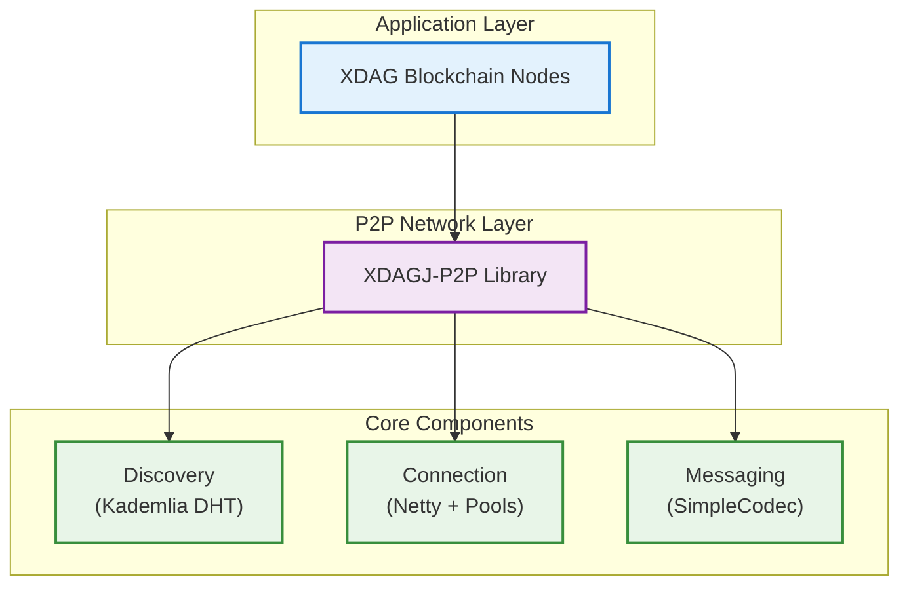

# XDAGJ-P2P

[](https://openjdk.java.net/)
[](https://maven.apache.org/)
[](LICENSE)
[](#testing)
[](#testing)

High-performance Java P2P networking library for the XDAG blockchain ecosystem, built with modern Java technologies and comprehensive testing.

**Key Features:** Kademlia DHT discovery • Persistent reputation system • Graduated ban management • Layered network statistics • Production-ready with 859 tests

---

## What's New in v0.1.2

### Breaking Change: Node ID Migration
- Migrated from 520-bit to **160-bit Node ID** format (XDAG address-based)
- Perfect Kademlia DHT compliance (BitTorrent DHT standard)
- 69% storage reduction per node (65 bytes → 20 bytes)
- ⚠️ Not compatible with v0.1.0/0.1.1 nodes

### New Features
- **Reputation System Persistence**: Automatic disk-based saves with time-based decay
- **Simplified Ban Management**: Graduated durations and whitelist support
- **Enhanced Monitoring**: LayeredStats for network and application layer metrics
- **Improved Test Coverage**: 88.9% for XdagMessageHandler, 57.2% for P2pPacketDecoder

### Code Quality
- Removed 2,277 lines of dead code following extreme simplicity principles
- Simplified statistics system (5 classes → 1 class, -72% code)
- Added 368+ new tests (859 total, all passing)
- Overall coverage improved: 62.9% → 76% (+13.1%)

See [CHANGELOG.md](CHANGELOG.md) for complete release notes.

---

## Quick Start

### Prerequisites
- **Java 21+** (Latest LTS with Virtual Threads support)
- **Maven 3.6+** for dependency management

### Maven Dependency
```xml
<dependency>
    <groupId>io.xdag</groupId>
    <artifactId>xdagj-p2p</artifactId>
    <version>0.1.2</version>
</dependency>
```

> **⚠️ Breaking Change**: Node ID format changed from 520-bit to 160-bit XDAG address. Not compatible with v0.1.0/0.1.1 nodes.

### Basic Usage

```java
// 1. Configure P2P service
P2pConfig config = new P2pConfig();
config.setPort(16783);
config.setDiscoverEnable(true);
config.setSeedNodes(Arrays.asList(
    new InetSocketAddress("<SEED_NODE_IP>", 16783)
));

// 2. Implement event handler
public class MyEventHandler extends P2pEventHandler {
    @Override
    public void onConnect(Channel channel) {
        System.out.println("Connected: " + channel.getRemoteAddress());
    }

    @Override
    public void onMessage(Channel channel, Bytes data) {
        // Process incoming messages
    }
}

// 3. Start P2P service
P2pService p2pService = new P2pService();
p2pService.register(new MyEventHandler());
p2pService.start(config);
```

### Run Standalone Node

```bash
# Build the project
mvn clean package -DskipTests

# Run P2P node
java -jar target/xdagj-p2p-0.1.2-jar-with-dependencies.jar \
  -p 16783 \
  -s <SEED_NODE_IP>:16783
```

**See [docs/EXAMPLES.md](docs/EXAMPLES.md) for more examples including custom message implementation.**

---

## Core Features

### Kademlia DHT Discovery
- **160-bit Node ID** based on XDAG address
- Distributed hash table protocol for decentralized peer discovery
- UDP-based PING/PONG for liveness detection
- Recursive node discovery via FIND_NODE/NEIGHBORS
- Self-healing network topology

### Node Reputation System
- Persistent disk-based scoring (0-200 range)
- Time-based reputation decay (5 points/day towards neutral)
- Automatic save with atomic file operations
- Thread-safe concurrent operations

### Ban Management
- Graduated ban durations for repeat offenders (2x per offense, max 30 days)
- Whitelist support for trusted nodes
- Automatic expiry and cleanup

### Layered Statistics
- **Network Layer**: TCP/Netty frame-level metrics (messages sent/received, bytes transferred)
- **Application Layer**: Business logic metrics (processed, duplicated, forwarded messages)
- Per-channel statistics tracking
- Zero external dependencies

**See [docs/NODE_DISCOVERY.md](docs/NODE_DISCOVERY.md) for detailed discovery configuration.**

---

## Performance

### Benchmark Results
```
Message Processing:     1.3M - 8M ops/sec
Network I/O:            0.8M - 2M ops/sec
Serialization:          4M - 22M ops/sec
Data Access:            98M - 206M ops/sec
Concurrent (4 threads): 19M ops/sec

Network Throughput:     17,000+ msg/sec (6-node cluster)
Message Latency:        1-8ms (95% under 8ms)
Error Rate:            0% (7M+ messages tested)
```

### Test Coverage
```
Tests:          859 test cases (100% pass rate)
Instructions:   76% (12,162 / 15,810)
Branches:       64% (911 / 1,409)
Lines:          77% (2,851 / 3,669)
Execution:      ~30 seconds, zero flaky tests
```

**See [docs/PERFORMANCE.md](docs/PERFORMANCE.md) for detailed benchmark methodology and results.**

---

## Architecture



### Components

**Discovery Engine**
- Kademlia DHT for distributed peer discovery
- K-bucket routing table (k=16, 160 buckets)
- Automatic stale node detection and replacement

**Connection Manager**
- Netty async I/O with event loops
- Connection pool with adaptive limits
- Automatic recovery from failures

**Message Router**
- Custom SimpleCodec encoding (extensible, backward-compatible)
- Type-safe message definitions
- Efficient message delivery with batching

---

## Technology Stack

### Core
- **Java 21 LTS**: Virtual threads and modern APIs
- **Netty 4.2.6.Final**: Async I/O framework with zero-copy buffers
- **Custom SimpleCodec**: High-performance binary encoding

### Cryptography
- **Hyperledger Besu 25.5.0**: Crypto primitives
- **BouncyCastle 1.80**: Crypto provider
- **Tuweni 2.7.0**: Packet processing utilities

### Testing
- **JUnit 5.12.2 + Mockito 5.14.2**: 859 comprehensive tests
- **JaCoCo**: 76% instruction coverage
- **Professional test suite**: Multi-node network testing

---

## Network Performance Visualization

Real-world P2P network testing with 20 nodes demonstrating production-level performance.

<div align="center">

#### Network Topology Analysis

*Distributed node connections with network diameter of 5 hops*

#### Node Performance Comparison

*Consistent sub-10ms latency across all nodes*

#### Connection Statistics

*Network health and load distribution*

#### Message Latency Distribution

*95% of messages under 8ms response time*

</div>

**Key Metrics:**
```
Network Scale:       20 distributed nodes
Total Connections:   108 P2P links
Network Diameter:    5 hops maximum
Average Path:        2.38 hops
Connection Success:  >99% reliability
```

---

## Testing

### Run Unit Tests
```bash
# All 859 tests
mvn test

# Generate coverage report
mvn clean test jacoco:report
open target/site/jacoco/index.html
```

### Professional Network Testing
```bash
cd test-nodes

# Quick test: 6 nodes
./start-p2p-network.sh 6
./monitor-nodes.sh

# Stress test: 20 nodes
./start-p2p-network.sh 20
sleep 300
python3 analyze-network-performance.py --logs-dir logs

# Stop all nodes
./stop-nodes.sh
```

**Test Capabilities:**
- 17 message types for comprehensive coverage
- Automated 5-30 node scaling tests
- Real-time monitoring and visualization
- Professional reports with CSV export

**See [test-nodes/README.md](test-nodes/README.md) for detailed testing guide.**

---

## Use Cases

### XDAG Blockchain Network
- Peer discovery for XDAG blockchain nodes
- Block and transaction propagation
- Consensus mechanism communication
- Enhanced network connectivity and decentralization

### General Purpose
- Blockchain networks (universal P2P solution)
- Distributed systems (service discovery, data replication)
- IoT networks (self-organizing mesh networks)

---

## Node Discovery

XDAGJ-P2P uses **Kademlia DHT** for fully decentralized peer-to-peer discovery.

### Current Method (v0.1.2)

```bash
# Start node with seed nodes
java -jar xdagj-p2p-0.1.2.jar \
  -p 16783 \
  -s <SEED_NODE_IP_1>:16783,<SEED_NODE_IP_2>:16783
```

**How it works:**
1. Connect to seed nodes via TCP
2. Exchange UDP PING/PONG for liveness detection
3. Recursive peer discovery via FIND_NODE/NEIGHBORS
4. Build network topology with 160-bit Node IDs
5. Maintain routing table with active nodes

**Advantages:**
- Fully decentralized (no central authority)
- Self-organizing network topology
- No single point of failure
- Real-time node discovery

### Configuration Examples

**Production (24/7 nodes):**
```bash
java -jar xdagj-p2p-0.1.2.jar \
  -p 16783 \
  -s <SEED_NODE_IP_1>:16783,<SEED_NODE_IP_2>:16783,<SEED_NODE_IP_3>:16783
```

**Development/Testing:**
```bash
java -jar xdagj-p2p-0.1.2.jar \
  -p 16783 \
  -s 127.0.0.1:10000,192.168.1.100:16783
```

**Private Networks:**
```bash
java -jar xdagj-p2p-0.1.2.jar \
  -p 16783 \
  -s 10.0.1.10:16783,10.0.1.11:16783
```

**See [docs/NODE_DISCOVERY.md](docs/NODE_DISCOVERY.md) for technical details, best practices, and future DNS discovery plans.**

---

## Documentation

- **[User Guide](docs/USER_GUIDE.md)** - Complete usage guide
- **[Examples](docs/EXAMPLES.md)** - Code examples and use cases
- **[Node Discovery](docs/NODE_DISCOVERY.md)** - Discovery mechanisms and configuration
- **[DNS Configuration](docs/DNS_CONFIGURATION.md)** - EIP-1459 DNS discovery setup with AWS Route53
- **[Reputation System](docs/REPUTATION.md)** - Node credit scoring and persistence
- **[Performance](docs/PERFORMANCE.md)** - Benchmark methodology and results
- **[Roadmap](docs/ROADMAP.md)** - Development roadmap and planned features
- **[Migration Guide](NODE_ID_MIGRATION_PLAN.md)** - 520-bit to 160-bit migration
- **[Testing Guide](test-nodes/README.md)** - Professional network testing
- **[Change Log](CHANGELOG.md)** - Version history

---

## Contributing

We welcome contributions! Please feel free to submit a Pull Request. For major changes, please open an issue first to discuss what you would like to change.

### Development
```bash
# Build
mvn clean package

# Run tests
mvn test

# Run coverage
mvn clean test jacoco:report
```

---

## License

This project is licensed under the MIT License - see the [LICENSE](LICENSE) file for details.

---

## Support

- **GitHub Issues**: [Report bugs or request features](https://github.com/XDagger/xdagj-p2p/issues)
- **XDAG Community**: Join the XDAG network community for discussions
- **Documentation**: See [docs/](docs/) for comprehensive guides

---

**Status:** v0.1.2 Production-Ready | **Tests:** 859 passing | **Coverage:** 76%
