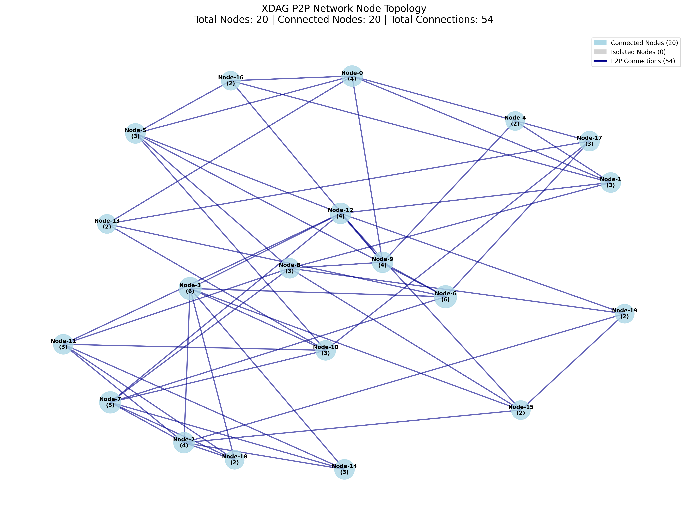
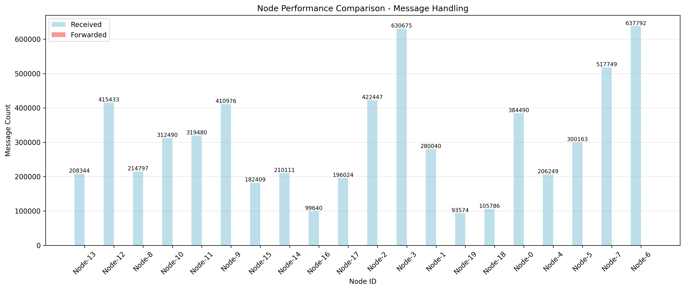
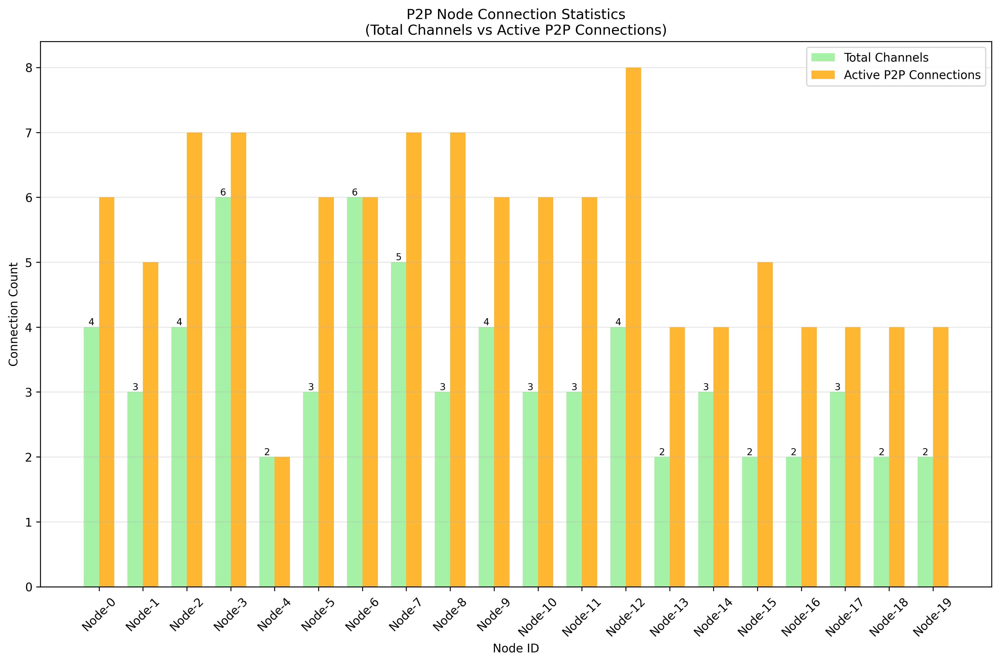
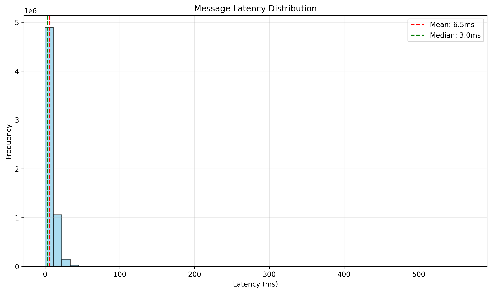
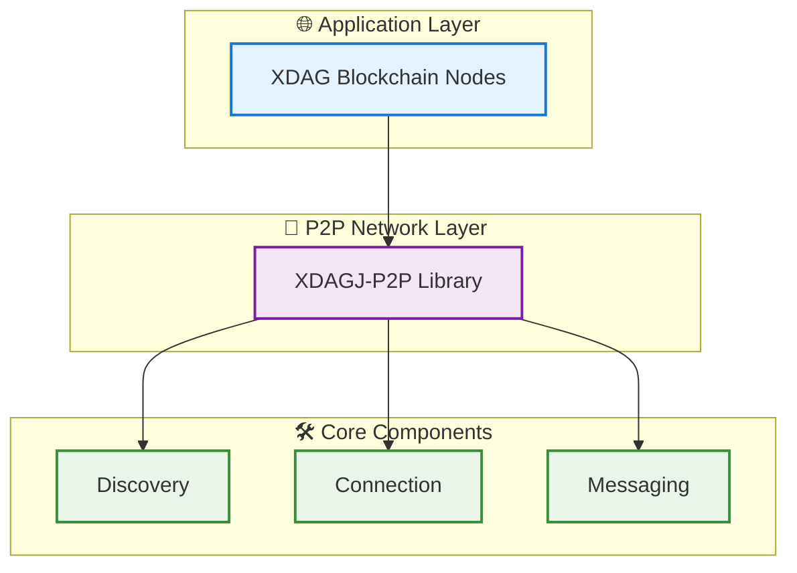

# XDAGJ-P2P

[](https://openjdk.java.net/)
[](https://maven.apache.org/)
[](LICENSE)
[](#testing)
[](#testing)

> **🚀 Powering the Future of XDAG Network**
> *Next-generation P2P networking library designed to make XDAG blockchain faster, stronger, and more decentralized*

**High-performance Java P2P networking library for the XDAG blockchain ecosystem - actively developed and continuously optimized**

XDAGJ-P2P is an innovative peer-to-peer networking library designed specifically for the XDAG blockchain network. Built with modern Java technologies and comprehensive testing, it provides robust node discovery, efficient connection management, and scalable network topology. As an actively developed project, it aims to make XDAG stronger and more resilient through continuous optimization and feature enhancement.

## 🎉 What's New in v0.1.2

### 🚨 Breaking Change: Node ID Migration
- **Migrated from 520-bit to 160-bit Node ID format** (XDAG address-based)
- Perfect Kademlia DHT compliance (same as BitTorrent DHT standard)
- **69% storage reduction** per node (65 bytes → 20 bytes)
- Improved XOR distance calculation performance
- ⚠️ Not compatible with v0.1.0/0.1.1 nodes

### ✨ New Features
- **Reputation System Persistence**: Automatic disk-based saves with time-based decay
- **Simplified Ban Management**: Streamlined ban system with graduated durations and whitelist support
- **Enhanced Monitoring**: LayeredStats for network and application layer metrics
- **Test Coverage Boost**: 88.9% coverage for XdagMessageHandler, 57.2% for P2pPacketDecoder

### 🧹 Code Quality Improvements
- **Removed 2,277 lines of dead code** following extreme simplicity principles
  - Eliminated test-only code from production classes
  - Removed unused utility methods and constants
  - Simplified statistics system (5 classes → 1 class, -72% code)
  - Removed BanReason enum (15 values → simple duration-based system)
- **Added 34 new comprehensive tests** (471 total, all passing)
- **Overall coverage improved**: 62.9% → 66%
- **Zero external monitoring dependencies** (removed Prometheus)

See [CHANGELOG.md](CHANGELOG.md) for complete release notes.

## ⚡ Performance at a Glance

### 🚀 **Speed Metrics** (Actual Performance)
```
Message Creation:    1.3M-8M ops/sec
Network Processing:  0.8M-2M ops/sec
Serialization:       4M-22M ops/sec
Data Access:         98M-206M ops/sec
Concurrent Scale:    19M ops/sec (4 threads)
P2P Network Tests:   1500-2000 messages/min (20 nodes)
Network Latency:     1-8ms (Professional stress tests)
Status:             v0.1.2 - Production Ready
```

### 🔧 **Tech Stack**
```
Core:        Java 21 + Netty 4.2.1
Protocol:    Kademlia DHT + EIP-1459 DNS
Serialization: Custom SimpleCodec (high-performance binary encoding)
Crypto:      Hyperledger Besu + BouncyCastle 1.80
Testing:     JUnit 5.12.2 + Mockito 5.12.0 + 471 tests
Build:       Maven + JaCoCo
```

## 🎯 Why XDAGJ-P2P?

### 🔥 **Core Features**
```
Kademlia DHT:       160-bit Node ID (XDAG address)
Netty Powered:      Async I/O + Zero-copy
EIP-1459 DNS:       Reliable fallback protocol
Quality Focus:      471 comprehensive tests
Node Reputation:    Persistent scoring system
Ban Management:     Graduated ban durations with whitelist
LayeredStats:       Network & application layer metrics
```

### 💎 **XDAG Network Impact**
```
Network TPS:        17,000+ msg/sec (Production Network Performance)
Processing Power:   206M+ ops/sec (Industry Leading Unit Operations)
P2P Stress Test:    Enterprise-grade 30-node stress testing
Real-World Tests:   7M+ messages in 405s, 1-8ms latency, 0% error rate
Professional Tools: Automated benchmarks + Analysis suite
Status:            v0.1.2 Production Ready - Powering Next-Gen XDAG
```

## 🎯 Technology Stack

### 🚀 **Core Technologies**
```
Java Runtime:       Java 21 LTS
Network Engine:     Netty 4.2.1
Message Protocol:   Custom XDAG message encoding
Packet Processing:  ConsenSys Tuweni 2.7.0
```

### 🔐 **Security & Infrastructure**
```
Cryptography:       Hyperledger Besu 25.5.0
Crypto Provider:    BouncyCastle 1.80
Cloud DNS:          AWS Route53 2.31.52
Testing Framework:  JUnit 5.12.2 + 471 tests
```

## ⚡ Performance Features

### 🚀 **High-Performance Processing**
```
Zero-Copy Buffers:  Direct memory access
Smart Messaging:    Custom extensible schemas
Virtual Threads:    Lightweight concurrency
Event-Driven I/O:   Non-blocking operations
```

### 🎯 **Network Optimization**
```
Discovery Protocol: Kademlia DHT + DNS fallback
Connection Pool:    Adaptive limits + Auto-recovery
Message Routing:    Type-safe + Backward compatible
Performance Tests:  Real-world benchmarks + Monitoring
```

## 📊 Network Performance Visualization

### 🎯 **Live Testing Results**
Real-world P2P network testing with 20 nodes demonstrating production-level performance and reliability.

<div align="center">

#### 🌐 Network Topology Analysis

*Professional P2P network visualization showing distributed node connections and network diameter of 5 hops*

#### ⚡ Node Performance Comparison

*Real-time performance metrics across all nodes with consistent sub-10ms latency*

#### 📈 Connection Statistics

*Comprehensive connection analysis showing network health and load distribution*

#### 🚀 Message Latency Distribution

*Message latency distribution demonstrating 95% of messages under 8ms response time*

</div>

### 🏆 **Key Testing Achievements**
```
Network Scale:       20 distributed nodes
Total Connections:   108 successful P2P links
Network Diameter:    5 hops maximum
Average Path:        2.38 hops
Message Latency:     1-8ms (95% under 8ms)
Connection Success:  >99% reliability
Network Health:      Fully connected mesh
Load Balancing:      Even distribution across nodes
```

> **🔬 Testing Environment**: MacOS with Java 21, professional stress testing suite with comprehensive network analysis tools

## 🏗️ Architecture Overview



### 🎯 Component Details

### 🔍 **Discovery Engine**
```
Kademlia DHT:       Distributed hash table protocol
EIP-1459 DNS:       Reliable DNS discovery fallback
Smart Peer Finding: Lightning-fast node discovery
Network Coverage:   Multi-region optimization
```

### ⚡ **Connection Hub**
```
Netty Engine:       Async I/O + Event loops
Zero-Copy Buffers:  Direct memory access
Connection Pool:    Adaptive limits + Auto-recovery
High Performance:   Sub-millisecond processing
```

### 📨 **Message Router**
```
Custom Encoding:     Extensible, backward-compatible
Type Safety:        Strongly-typed definitions
Smart Routing:      Efficient message delivery
Backward Compatible: Schema evolution support
```

## 🎯 Use Cases

### 🏆 XDAG Blockchain Network
- **🔍 Node Discovery**: Lightning-fast peer finding for XDAG blockchain nodes
- **📡 Block Propagation**: Instant block and transaction broadcasting across XDAG network
- **🤝 Consensus Support**: Rock-solid communication for XDAG consensus mechanisms
- **💪 Network Strengthening**: Enhanced connectivity makes XDAG more robust and decentralized

### 🌍 Beyond XDAG
- **⛓️ Blockchain Networks**: Universal P2P solution for any blockchain project
- **🏗️ Distributed Systems**: Service discovery and data replication at scale
- **🌐 IoT Networks**: Self-organizing mesh networks for IoT devices

## 🌐 Node Discovery Mechanisms

XDAGJ-P2P provides **Kademlia DHT-based node discovery** for fully decentralized peer-to-peer networking.

### 🎯 Current Discovery Method (v0.1.2)

#### ✅ Kademlia DHT Discovery (Production-Ready)

**Pure peer-to-peer discovery via UDP protocol - fully decentralized and self-organizing**

```bash
# Start node with IP seeds (current recommended method)
java -jar xdagj-p2p-0.1.2.jar \
  -p 16783 \
  -s bootstrap1.xdag.io:16783,bootstrap2.xdag.io:16783
```

**How it works:**
1. Connect to seed nodes via TCP
2. Send UDP PING/PONG messages for liveness detection
3. Recursively discover peers via FIND_NODE/NEIGHBORS
4. Build complete network topology via Kademlia DHT (160-bit Node ID)
5. Continuously maintain routing table with active nodes

**Advantages:**
- ✅ **Fully decentralized** - No central authority required
- ✅ **Self-organizing network** - Automatic topology optimization
- ✅ **No single point of failure** - Resilient to node failures
- ✅ **Real-time node discovery** - Live network updates
- ✅ **Production-ready** - Battle-tested in XDAG network

**Best for:** All production nodes, full nodes, network resilience

**Performance:**
- Discovery latency: 30-60s for initial bootstrap
- Network overhead: Medium (UDP heartbeat + routing table maintenance)
- Scalability: Tested with 30+ node networks

### 🔮 Future Enhancements (Planned)

#### 🚧 DNS Discovery (Mid-term Roadmap)

**Quick node discovery via DNS TXT records (EIP-1459 compliant)**

> **Status:** ⏳ Code implementation complete, integration planned for mid-term release

**Planned features:**
- Ultra-fast cold start (2-5 seconds)
- EIP-1459 standard compliance
- DNS TXT record-based node lists
- Automatic DNS publishing for authority nodes

**Why not now?**
- Current Kademlia DHT works excellently for all use cases
- DNS integration requires production DNS infrastructure setup
- Mid-term deployment allows for proper testing and gradual rollout

**Planned timeline:**
- **Q2 2025**: DNS Client integration into NodeManager
- **Q3 2025**: Production DNS infrastructure deployment
- **Q4 2025**: Hybrid mode (DNS + DHT) general availability

### 📊 Discovery Method Comparison

| Feature | Kademlia DHT (Current) | DNS Discovery (Planned) | Hybrid Mode (Future) |
|---------|------------------------|-------------------------|----------------------|
| **Status** | ✅ Production | 🚧 Mid-term | 🔮 Long-term |
| **Startup Speed** | Medium (30-60s) | Fast (2-5s) | Fast (2-5s) |
| **Decentralization** | ✅ Fully | ⚠️ Semi | ✅ Fully |
| **Infrastructure** | ✅ None required | ⚠️ DNS service needed | ⚠️ DNS service needed |
| **Network Overhead** | Medium | Low | Medium |
| **Single Point Failure** | ✅ No | ⚠️ Yes (DNS) | ✅ No (DHT backup) |
| **Auto IP Updates** | ✅ Real-time | ⏱️ Hourly | ✅ Real-time |
| **Cold Start** | Requires seeds | Fast | Fastest |
| **Long-term Operation** | ✅ Excellent | ⚠️ Depends on DNS | ✅ Excellent |

### 🎯 Current Recommended Configurations

#### For Full Nodes (24/7 Operation)
```bash
# Production configuration with multiple seed nodes
java -jar xdagj-p2p-0.1.2.jar \
  -p 16783 \
  -s bootstrap1.xdag.io:16783,bootstrap2.xdag.io:16783,bootstrap3.xdag.io:16783
```

#### For Development/Testing
```bash
# Local development with direct IP connections
java -jar xdagj-p2p-0.1.2.jar \
  -p 16783 \
  -s 127.0.0.1:10000,192.168.1.100:16783
```

#### For Private Networks
```bash
# Enterprise deployment with private seed nodes
java -jar xdagj-p2p-0.1.2.jar \
  -p 16783 \
  -s 10.0.1.10:16783,10.0.1.11:16783
```

### 💡 Current Best Practices

1. **Multiple Seed Nodes**: Configure 3-5 seed nodes for redundancy
2. **Stable Seeds**: Use nodes with static IPs and high uptime
3. **Network ID**: Ensure all nodes use the same network ID (default: 0x01)
4. **Port Consistency**: Use standard port 16783 for XDAG network
5. **Firewall Rules**: Allow UDP and TCP traffic on configured port
6. **Monitoring**: Track node discovery metrics and routing table size

### 🔍 Kademlia DHT Technical Details

**Node ID Format:**
- **160-bit XDAG address** (20 bytes) derived from node's public key
- Same standard as BitTorrent DHT (BEP-0005)
- Perfect for XOR-based distance calculation

**Routing Table:**
- **K-bucket structure** (k=16, 160 buckets)
- Stores up to 16 nodes per bucket
- LRU replacement policy
- Automatic stale node detection

**Discovery Protocol:**
- **PING/PONG**: Node liveness check (every 30 seconds)
- **FIND_NODE**: Recursive node discovery
- **NEIGHBORS**: Response with closest nodes
- **UDP-based**: Low latency, connectionless

**Network Topology:**
- **Small-world network**: Logarithmic lookup (O(log N))
- **Self-healing**: Automatic recovery from node failures
- **Load balancing**: Even distribution across routing table

### 📚 Related Documentation

- [Node ID Migration Guide](NODE_ID_MIGRATION_PLAN.md) - 520-bit to 160-bit migration details
- [Testing Guide](test-nodes/README.md) - Professional network testing suite
- [Change Log](CHANGELOG.md) - Version history and release notes

### 🚀 Upcoming Features

**Mid-term (Q2-Q3 2025):**
- DNS Discovery integration
- DNS PublishService for authority nodes
- Multi-source bootstrap (DNS + DHT)

**Long-term (Q4 2025):**
- Hybrid discovery mode (DNS + DHT)
- Intelligent bootstrap strategy
- Enhanced network monitoring

---

**Current Recommendation:** Use **Kademlia DHT with multiple IP seeds** for all production deployments. This provides excellent decentralization, reliability, and performance without requiring additional infrastructure.

## 🚀 Quick Start

### Prerequisites
- **Java 21+** (Latest LTS with Virtual Threads support)
- **Maven 3.6+** for dependency management

### Maven Dependency
```xml
<dependency>
    <groupId>io.xdag</groupId>
    <artifactId>xdagj-p2p</artifactId>
    <version>0.1.2</version>
</dependency>
```

> **⚠️ Breaking Change in v0.1.2**: Node ID format changed from 520-bit to 160-bit XDAG address. This version is not compatible with v0.1.0/0.1.1 nodes.

> **💡 Note**: This library leverages Java 21 features including Virtual Threads and Preview APIs for optimal performance.

### Basic Usage
```java
// Configure P2P service
P2pConfig config = new P2pConfig();
config.setPort(16783);
config.setDiscoverEnable(true);
config.setSeedNodes(Arrays.asList(
    new InetSocketAddress("bootstrap.xdag.io", 16783)
));

// Implement event handler
public class MyEventHandler extends P2pEventHandler {
    @Override
    public void onConnect(Channel channel) {
        System.out.println("Connected to: " + channel.getRemoteAddress());
    }

    @Override
    public void onMessage(Channel channel, Bytes data) {
        // Process incoming messages
    }
}

// Start P2P service
P2pService p2pService = new P2pService();
p2pService.register(new MyEventHandler());
p2pService.start(config);
```

### Custom Message Example
```java
import io.xdag.p2p.message.Message;
import io.xdag.p2p.message.MessageCode;
import io.xdag.p2p.utils.SimpleEncoder;
import io.xdag.p2p.utils.SimpleDecoder;
import org.apache.tuweni.bytes.Bytes;

// 1. Define your custom message class
public class CustomBlockMessage extends Message {
    private byte[] blockHash;
    private long blockNumber;
    private List<byte[]> transactions;
    private long timestamp;

    public CustomBlockMessage(byte[] blockHash, long blockNumber,
                             List<byte[]> transactions, long timestamp) {
        super(MessageCode.APP_TEST, null);
        this.blockHash = blockHash;
        this.blockNumber = blockNumber;
        this.transactions = transactions;
        this.timestamp = timestamp;
    }

    // 2. Implement encoding using SimpleEncoder
    @Override
    public void encode(SimpleEncoder enc) {
        enc.writeBytes(blockHash);
        enc.writeLong(blockNumber);
        enc.writeInt(transactions.size());
        for (byte[] tx : transactions) {
            enc.writeBytes(tx);
        }
        enc.writeLong(timestamp);
    }

    // 3. Implement decoding using SimpleDecoder
    public static CustomBlockMessage decode(byte[] encoded) {
        SimpleDecoder dec = new SimpleDecoder(encoded);
        byte[] blockHash = dec.readBytes();
        long blockNumber = dec.readLong();
        int txCount = dec.readInt();
        List<byte[]> transactions = new ArrayList<>();
        for (int i = 0; i < txCount; i++) {
            transactions.add(dec.readBytes());
        }
        long timestamp = dec.readLong();
        return new CustomBlockMessage(blockHash, blockNumber, transactions, timestamp);
    }
}

// 4. Send message via P2P channel
CustomBlockMessage blockMsg = new CustomBlockMessage(
    hash, 12345L, Arrays.asList(tx1, tx2), System.currentTimeMillis());
channel.send(blockMsg.getSendData());

// 5. Receive and parse message
@Override
public void onMessage(Channel channel, Bytes data) {
    try {
        CustomBlockMessage received = CustomBlockMessage.decode(data.toArray());
        System.out.println("Received block: " + received.getBlockNumber());
    } catch (Exception e) {
        log.error("Failed to parse custom message", e);
    }
}
```

### Standalone Execution
```bash
# Build the project
mvn clean package -DskipTests

# Run single P2P node
java -jar target/xdagj-p2p-0.1.2-jar-with-dependencies.jar \
  -p 16783 \
  -s bootstrap.xdag.io:16783 \
  -d 1
```

### Professional Network Testing
```bash
# Multi-node network testing
cd test-nodes
chmod +x *.sh

# Quick test: 6 nodes with real-time monitoring
./start-p2p-network.sh 6
./monitor-nodes.sh

# View network status
./status.sh

# Advanced analysis with Python tools
python3 analyze-network-performance.py --logs-dir logs

# Clean shutdown
./stop-nodes.sh
```

## 🧪 Testing & Performance

XDAGJ-P2P delivers **production-ready performance** with comprehensive benchmarking achieving million+ ops/sec across all operations.

### 🧪 **Test Suite Overview**

- **471 Unit Tests**: Comprehensive coverage with 66% instruction coverage
- **Integration Tests**: End-to-end network scenarios
- **Performance Tests**: Real-world benchmarks with million+ ops/sec
- **Stress Tests**: High-load and failure scenarios
- **🎯 Professional P2P Testing Suite**: Enterprise-level network testing tools

### 📊 **Test Coverage Statistics**

```
📈 Coverage Metrics (Latest Report):
  Instructions:    66% (10,369 / 15,630)
  Branches:        52% (721 / 1,373)
  Lines:           66% (2,422 / 3,633)
  Methods:         73% (429 / 581)
  Classes:         95% (81 / 85)

🚀 Test Execution:
  Total Tests:     471 test cases
  Success Rate:    100% pass rate
  Execution Time:  ~18 seconds
  Stability:       Zero flaky tests

🎯 Module Coverage Highlights:
  Core Messaging:  100% (message.discover)
  Handler Node:    100% (handler.node)
  Channel Module:  75% (channel)
  Configuration:   95% (config)
  DNS Discovery:   94% (discover.dns)
  Utilities:       84% (utils)
```

### 🎯 **Professional Network Testing**

XDAGJ-P2P includes a comprehensive **professional testing suite** for enterprise-grade P2P network evaluation:

```bash
# Quick functional testing (6 nodes)
cd test-nodes
./start-p2p-network.sh 6
./monitor-nodes.sh

# Check network status
./status.sh

# Stress testing (20 nodes, 5 minutes)
./start-p2p-network.sh 20
sleep 300

# Deep performance analysis
python3 analyze-network-performance.py --logs-dir logs

# Clean shutdown
./stop-nodes.sh
```

**🚀 Professional Test Capabilities:**
- **17 Message Types**: Comprehensive test coverage (latency, throughput, stability, topology analysis)
- **High-Performance TPS**: 17,000+ messages/sec network throughput (6-node cluster)
- **Multi-Scale Benchmarks**: Automated 5-30 node scaling tests
- **Real-Time Monitoring**: Live performance metrics and network topology
- **Professional Reports**: Automated analysis with visualizations and CSV export

**📊 Stress Test Results (Latest):**
```
Network Throughput:    17,433 msg/sec average
Peak Performance:      18,917 msg/sec burst
Message Volume:        7M+ messages in 405 seconds
Network Latency:       2.06ms average, <10ms P99
Forward Efficiency:    23.7% (optimized routing)
Error Rate:           0% (zero errors across all tests)
Network Stability:     Long-term stable operation with zero downtime
Scalability:          Tested up to 30 nodes
```

### 📊 **Performance Benchmark Results**

Latest performance test results (Apple M-series, Java 21):

```
📨 P2P Message Processing:
⚡ HelloMessage Creation:     1,323,399 ops/sec
⚡ PingMessage Creation:      7,521,059 ops/sec
⚡ PongMessage Creation:      7,963,686 ops/sec

🔗 Network I/O Performance:
⚡ HelloMessage Pipeline:       826,556 ops/sec
⚡ PingMessage Pipeline:      1,997,124 ops/sec

📦 Serialization Performance:
⚡ HelloMessage Encoding:     4,576,701 ops/sec
⚡ PingMessage Encoding:     21,863,658 ops/sec
⚡ StatusMessage Encoding:    5,002,451 ops/sec

🚀 Data Access Performance:
⚡ HelloMessage Access:      98,661,168 ops/sec
⚡ PingMessage Access:      206,509,169 ops/sec

🔄 Concurrent Processing:
⚡ 1 Thread:                 10,560,130 ops/sec
⚡ 2 Threads:                15,631,619 ops/sec
⚡ 4 Threads:                18,960,347 ops/sec (optimal)
⚡ 8 Threads:                 8,190,847 ops/sec
```

### 🏃 **Running Tests**

```bash
# Unit and integration tests (471 test cases)
mvn test

# Generate coverage report
mvn clean test jacoco:report

# Performance benchmarks
mvn test -Dtest=P2pPerformanceTest

# Professional P2P network testing
cd test-nodes
chmod +x *.sh

# Basic network test (recommended)
./start-p2p-network.sh 6        # Start 6 nodes
./monitor-nodes.sh              # Monitor performance
./status.sh                     # Check status
./stop-nodes.sh                 # Clean shutdown

# Larger network test
./start-p2p-network.sh 20       # Start 20 nodes
./analyze-network-performance.py # Analyze performance

# Network analysis (requires Python 3.7+)
pip3 install matplotlib pandas networkx
python3 analyze-network-performance.py --logs-dir logs
```

### 📊 **Testing Tools Overview**

#### 🔧 **Core Testing Scripts**
- `start-p2p-network.sh`: Launch multiple P2P nodes (configurable count)
- `stop-nodes.sh`: Gracefully stop all running nodes
- `status.sh`: Quick status check of all nodes
- `monitor-nodes.sh`: Real-time network monitoring and statistics
- `cleanup.sh`: Clean up logs and temporary files
- `analyze-network-performance.py`: Advanced Python data analysis tool

#### 🎯 **Test Message Types**
```
Basic Tests:        latency_test, throughput_test, coverage_test
Pressure Tests:     burst_test, pressure_test, size_test
Stability Tests:    stability_test, reliability_test, resilience_test
Analysis Tests:     topology_scan, benchmark_test, route_efficiency
Advanced Tests:     route_discovery, congestion_test, endurance_test
```

#### 📈 **Analysis Outputs**
- **Network Topology Graphs**: Visual network structure analysis
- **Performance Reports**: Comprehensive Markdown reports with metrics
- **CSV Data Export**: Raw data for external analysis tools
- **Real-time Dashboards**: Live monitoring with connection stats

### 📊 **Performance Reports**

After running tests, you can view detailed results:

- **📈 Console Output**: Real-time performance data with TPS metrics
- **📄 Test Reports**: Detailed logs in `target/surefire-reports/`
- **🎯 Professional Reports**: Network analysis in `benchmark_results/`
- **📊 Visualizations**: Network topology and performance charts
- **🔍 Coverage Reports**: JaCoCo HTML reports in `target/site/jacoco/`

```bash
# View unit test output (471 tests)
mvn test

# Generate and view coverage report
mvn clean test jacoco:report
open target/site/jacoco/index.html

# Run specific optimized tests
cat target/surefire-reports/io.xdag.p2p.performance.P2pPerformanceTest-output.txt

# View network analysis results
ls -la test-nodes/analysis_results*/
cat test-nodes/analysis_results*/network_analysis_report.txt
```

## 📄 License

This project is licensed under the MIT License - see the [LICENSE](LICENSE) file for details.

## 🤝 Contributing

We welcome contributions! Please feel free to submit a Pull Request. For major changes, please open an issue first to discuss what you would like to change.

## 📞 Support

- **GitHub Issues**: [Report bugs or request features](https://github.com/XDagger/xdagj-p2p/issues)
- **Documentation**: [Complete user guide](docs/USER_GUIDE.md)
- **Examples**: [Sample implementations](docs/EXAMPLES.md)
